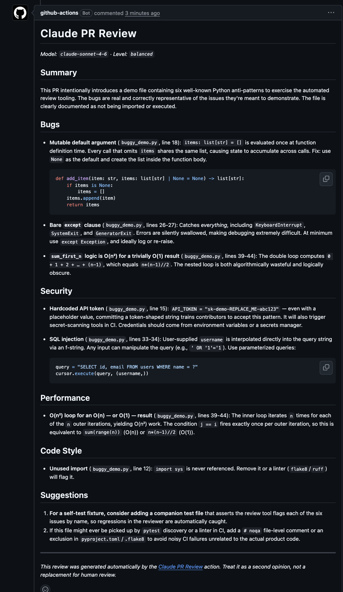

# Claude PR Review

A GitHub Action that automatically reviews pull requests using the [Anthropic Claude API](https://docs.anthropic.com/). It fetches the PR diff, sends it to Claude with a code-review system prompt, and posts a structured Markdown review back as a PR comment.

## What it does

On every `opened` or `synchronize` event for a pull request, this action:

1. Loads the PR metadata from the GitHub event payload.
2. Fetches the full unified diff via the GitHub REST API.
3. Filters out any files matching patterns in `.claude-review-ignore` (same syntax as `.gitignore`).
4. Sends the diff to Claude with a structured code-review system prompt.
5. If the diff exceeds the configured size limit (default 100 000 characters), splits it **per file** and reviews each file independently.
6. Posts (or updates) a single PR comment containing the review in Markdown, split into these sections:
   - **Summary**
   - **Bugs**
   - **Security**
   - **Performance**
   - **Code Style**
   - **Suggestions**

Subsequent pushes to the same PR update the existing comment instead of creating a new one.

## Installation

### 1. Add the `ANTHROPIC_API_KEY` secret

1. Go to your repository on GitHub.
2. **Settings → Secrets and variables → Actions → New repository secret**.
3. Name: `ANTHROPIC_API_KEY`.
4. Value: your Anthropic API key (get one from [console.anthropic.com](https://console.anthropic.com/)).

### 2. Add the workflow file

Create `.github/workflows/claude-review.yml` in your repo:

```yaml
name: Claude PR Review

on:
  pull_request:
    types: [opened, synchronize]

permissions:
  contents: read
  pull-requests: write

jobs:
  review:
    runs-on: ubuntu-latest
    steps:
      - uses: actions/checkout@v4
        with:
          fetch-depth: 0

      - uses: MuhammedAkinci/claude-pr-reviewer@v1
        with:
          anthropic_api_key: ${{ secrets.ANTHROPIC_API_KEY }}
```

> The `pull-requests: write` permission is required so the action can post review comments.
> The `contents: read` permission is required so the action can read the `.claude-review-ignore` file from the checked-out code.

See [`example-workflow.yml`](./example-workflow.yml) for a complete example.

## Configuration options

All inputs are passed via the `with:` block of the `uses:` step.

| Input | Required | Default | Description |
| --- | --- | --- | --- |
| `anthropic_api_key` | yes | — | Your Anthropic API key. Always load from a secret. |
| `github_token` | no | `${{ github.token }}` | Token used to read the diff and post comments. The default works for most repositories. |
| `model` | no | `claude-sonnet-4-6` | Claude model ID. See [supported models](#supported-models) below. |
| `review_level` | no | `balanced` | `strict`, `balanced`, or `lenient`. Controls how picky the review is. |
| `ignore_file` | no | `.claude-review-ignore` | Path of a `.gitignore`-style file listing files to skip. |
| `max_diff_chars` | no | `100000` | If the filtered diff is longer than this, fall back to per-file reviews. |
| `max_tokens` | no | `4096` | Max output tokens per Claude response. |

### Supported models

Pick the model that matches your cost/quality tradeoff. All three are valid values for the `model:` input.

| Model ID | Family | When to use |
| --- | --- | --- |
| `claude-opus-4-7` | Opus 4.7 | Deepest reasoning. Best for large PRs, architectural reviews, or security-critical code where false negatives are expensive. Highest cost. |
| `claude-sonnet-4-6` | Sonnet 4.6 | **Default.** Best coding model — high-quality reviews at moderate cost. Good all-round choice for most repos. |
| `claude-haiku-4-5` | Haiku 4.5 | Fast and cheap (~3× savings vs Sonnet, ~90% of the capability). Best for high-volume repos, trivial PRs, or keeping a tight CI budget. |

Example:

```yaml
- uses: MuhammedAkinci/claude-pr-reviewer@v1
  with:
    anthropic_api_key: ${{ secrets.ANTHROPIC_API_KEY }}
    model: claude-opus-4-7    # upgrade to Opus for this repo
```

### Review levels

- **`strict`** — flags every likely bug, security risk, performance regression, and style deviation.
- **`balanced`** — focuses on meaningful issues; skips trivial nitpicks. (Default.)
- **`lenient`** — only critical bugs, security vulnerabilities, or severe performance problems.

### `.claude-review-ignore`

Drop a `.claude-review-ignore` file in the repository root to exclude generated code, vendored libraries, lockfiles, etc. It uses the same syntax as `.gitignore`:

```gitignore
# Ignore lockfiles
package-lock.json
yarn.lock
pnpm-lock.yaml
poetry.lock

# Ignore generated code
**/generated/**
**/*.pb.go
**/*.g.dart

# Ignore vendored dependencies
vendor/**
third_party/**
```

### Large diffs

If the total diff exceeds `max_diff_chars` (default 100 000), the action switches from a single whole-PR review to **one Claude call per file**. The resulting PR comment groups the per-file reviews under a single **Per-file Reviews** section, so you still get one comment — not one per file.

## Example screenshot



## How I use this in my own workflow

1. Open a draft PR as soon as the branch compiles.
2. The action runs automatically, and the Claude review shows up as a comment within a minute or two.
3. I skim the **Bugs** and **Security** sections first — those are the only ones I treat as blocking.
4. For the **Performance** and **Code Style** sections, I cherry-pick what's worth addressing before human review.
5. When I push a new commit, the same comment is edited in place, so there's always a single up-to-date review on the PR.
6. Human review still happens on top. Claude is a second opinion, not a substitute for a real reviewer.

For repos where I don't want noise on every push, I tighten the trigger:

```yaml
on:
  pull_request:
    types: [opened, ready_for_review]  # skip synchronize
```

…or gate on a label:

```yaml
jobs:
  review:
    if: contains(github.event.pull_request.labels.*.name, 'needs-claude-review')
```

## Troubleshooting

- **`403` when posting a comment** — the workflow is missing `pull-requests: write`.
- **`403` when fetching the diff** — the workflow is missing `contents: read`, or the PR is from a fork with restricted token scope. Add the permissions block shown above.
- **Rate-limit errors** — the action retries with exponential backoff up to 5 times. Consistent failures mean you're over your Anthropic org's rate limit; upgrade tier or reduce trigger frequency.
- **Nothing happens on fork PRs** — by GitHub's security model, PRs from forks don't receive secrets. The self-test workflow in this repo guards against that with an explicit `if:` check; copy the same pattern if needed.

## License

[MIT](./LICENSE)
